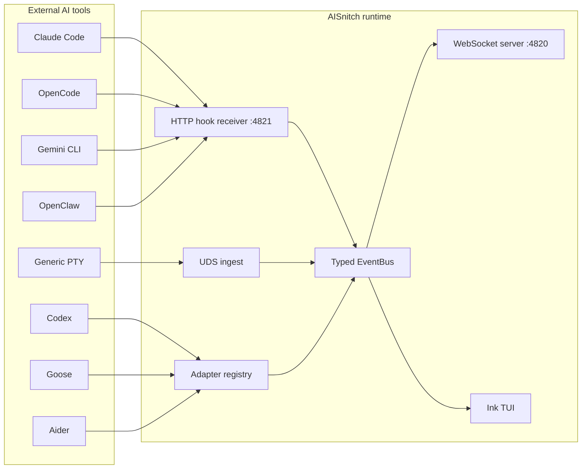

# AISnitch

[](https://github.com/vava-nessa/AISnitch/actions/workflows/ci.yml)
[](https://nodejs.org/)
[](./LICENSE)

Universal bridge for AI coding tool activity: capture, normalize, and stream live events from multiple AI coding tools into one local WebSocket feed and one terminal TUI.


AISnitch is deliberately live-only in the MVP:

- no persisted event store
- no replay UI
- no cloud dependency
- one in-memory pipeline, one normalized event stream

## Quick Start

```bash
pnpm install
pnpm build
node dist/cli/index.js start --mock all
```

That boots the foreground TUI with realistic fake events so you can inspect the product without installing any AI tool first.

## Install

### Local repository mode

```bash
pnpm install
pnpm build
node dist/cli/index.js --help
```

### Global npm install

```bash
npm i -g aisnitch
aisnitch --help
```

### Homebrew

The repository ships a Homebrew formula at [`Formula/aisnitch.rb`](./Formula/aisnitch.rb). The release workflow updates it from the real npm tarball SHA so it can be copied into a tap repository cleanly.

## What It Does

- watches hooks, plugins, transcripts, logs, and process fallbacks
- normalizes everything into one CloudEvents-flavored event schema
- exposes the stream over `ws://127.0.0.1:4820`
- receives hook traffic over `http://127.0.0.1:4821`
- renders a shared Ink TUI for both foreground mode and daemon attach
- preserves raw source payloads in `event.data.raw`
- stays memory-only for privacy and operational simplicity

## Supported Tools

| Tool | Status | Primary strategy | Setup command |
| --- | --- | --- | --- |
| Claude Code | ✅ Priority | HTTP hooks + JSONL + process fallback | `aisnitch setup claude-code` |
| OpenCode | ✅ Priority | Local plugin + process fallback | `aisnitch setup opencode` |
| Gemini CLI | ✅ | Hooks + `logs.json` + process fallback | `aisnitch setup gemini-cli` |
| Codex | ✅ | `codex-tui.log` + process fallback | `aisnitch setup codex` |
| Goose | ✅ | `goosed` polling + SSE + SQLite fallback | `aisnitch setup goose` |
| Copilot CLI | ✅ | Repo hooks + session-state watcher | `aisnitch setup copilot-cli` |
| Aider | ✅ | `.aider.chat.history.md` + notifications command | `aisnitch setup aider` |
| OpenClaw | ✅ | Managed internal hooks + command/memory/session watchers | `aisnitch setup openclaw` |
| Unknown / unsupported CLI | ✅ fallback | PTY wrapper heuristics | `aisnitch wrap <command>` |

## Core Commands

```bash
# Start foreground TUI
aisnitch start
aisnitch start --tool claude-code
aisnitch start --type agent.coding
aisnitch start --view full-data

# Background daemon + attach
aisnitch start --daemon
aisnitch status
aisnitch attach
aisnitch attach --view full-data
aisnitch stop

# Tool setup
aisnitch setup claude-code
aisnitch setup opencode
aisnitch setup gemini-cli
aisnitch setup aider
aisnitch setup codex
aisnitch setup goose
aisnitch setup copilot-cli
aisnitch setup openclaw
aisnitch setup claude-code --revert

# Demo / development
aisnitch mock claude-code --speed 2 --duration 20
aisnitch start --mock all --mock-duration 20

# Fallback for tools without a first-class adapter
aisnitch wrap aider --model sonnet
aisnitch wrap goose session
```

## Setup Notes

Adapters are disabled by default until you arm them with `setup`. After setup:

```bash
aisnitch adapters
```

You should see the tool listed as `enabled`. That only means the AISnitch-side bridge is armed. You still need to actually run the tool while AISnitch is running to receive events.

## TUI

The TUI is the main operator surface for both `start` and `attach`.

It includes:

- live event feed
- active session panel
- tool / event-type / query filtering
- freeze / clear controls
- a colorful full-data inspector showing normalized JSON plus raw payloads

### Keybinds

- `q` / `Ctrl+C`: quit
- `v`: toggle full-data inspector
- `f`: tool filter picker
- `t`: event-type filter picker
- `/`: free-text search
- `Esc`: clear filters
- `Space`: freeze or resume tailing
- `c`: clear local buffer
- `?`: help overlay
- `Tab`: switch panel focus
- `↑` / `↓` or `j` / `k`: navigate rows / inspector
- `[` / `]`: page inspector up or down

## Architecture



## Event Model

AISnitch emits CloudEvents-style envelopes with AISnitch-specific extensions:

- `specversion`
- `id`
- `source`
- `type`
- `time`
- `aisnitch.tool`
- `aisnitch.sessionid`
- `aisnitch.seqnum`
- `data`

Important normalized event types:

- `session.start`
- `session.end`
- `task.start`
- `task.complete`
- `agent.idle`
- `agent.thinking`
- `agent.streaming`
- `agent.tool_call`
- `agent.coding`
- `agent.asking_user`
- `agent.compact`
- `agent.error`

See [`docs/events-schema.md`](./docs/events-schema.md) for the full contract.

## Build a Consumer

The WebSocket stream is intentionally simple:

```ts
import WebSocket from 'ws';

const ws = new WebSocket('ws://127.0.0.1:4820');

ws.on('message', (buffer) => {
  const event = JSON.parse(buffer.toString('utf8'));
  if (event.type === 'welcome') return;
  console.log(event.type, event['aisnitch.tool'], event.data);
});
```

Working examples:

- [`examples/basic-consumer.ts`](./examples/basic-consumer.ts)
- [`examples/mascot-consumer.ts`](./examples/mascot-consumer.ts)

## Config Reference

AISnitch stores local state under `~/.aisnitch/` by default. For isolated tests or sandboxed runs, every CLI command also honors `AISNITCH_HOME`.

Important paths:

- `~/.aisnitch/config.json`
- `~/.aisnitch/aisnitch.pid`
- `~/.aisnitch/daemon-state.json`
- `~/.aisnitch/daemon.log`
- `~/.aisnitch/aisnitch.sock`

Default ports:

- WebSocket: `4820`
- HTTP hooks: `4821`

## Testing

```bash
pnpm lint
pnpm typecheck
pnpm test
pnpm test:coverage
pnpm build
```

Real E2E smoke:

```bash
# Prereq: opencode installed and one provider authenticated
pnpm test:e2e
```

The E2E suite uses a dedicated Vitest config so it does not slow down `pnpm test`.

## Development Docs

- [`docs/index.md`](./docs/index.md)
- [`docs/core-pipeline.md`](./docs/core-pipeline.md)
- [`docs/cli-daemon.md`](./docs/cli-daemon.md)
- [`docs/tool-setup.md`](./docs/tool-setup.md)
- [`docs/priority-adapters.md`](./docs/priority-adapters.md)
- [`docs/secondary-adapters.md`](./docs/secondary-adapters.md)
- [`docs/testing.md`](./docs/testing.md)
- [`docs/distribution.md`](./docs/distribution.md)
- [`docs/launch-plan.md`](./docs/launch-plan.md)
- [`tasks/tasks.md`](./tasks/tasks.md)

## Contributing

Read:

- [`CONTRIBUTING.md`](./CONTRIBUTING.md)
- [`CODE_OF_CONDUCT.md`](./CODE_OF_CONDUCT.md)
- [`AGENTS.md`](./AGENTS.md)

## License

Apache-2.0, © Vanessa Depraute / vava-nessa.
