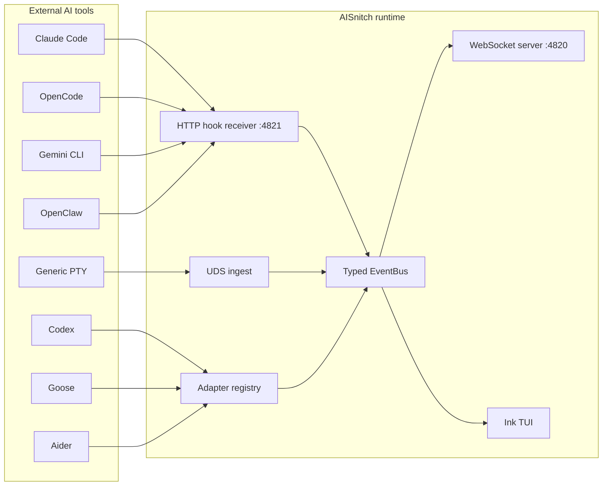

# AISnitch - alpha, work in progress !

[](https://github.com/vava-nessa/AISnitch/actions/workflows/ci.yml)
[](https://nodejs.org/)
[](./LICENSE)

**AISnitch** is a local event bridge for AI coding tools. It captures real-time activity from Claude Code, OpenCode, Gemini CLI, Codex, Goose, Aider, Copilot CLI, OpenClaw (and any CLI via PTY fallback), normalizes everything into one CloudEvents stream, and exposes it over a WebSocket on `ws://127.0.0.1:4820`.

You connect your own frontend, dashboard, companion app, notification system, or sound engine to that WebSocket, and you get live sentences like:

> *"Session #3 — Claude Code is thinking..."*
> *"#2 ~/projects/myapp — Codex: Refactoring tables — tool call: Edit file"*
> *"#5 Claude Code edited 4 JS files"*

No data is stored. No cloud. No logs on disk. Pure live memory-only transit.

---

## Table of Contents

- [Quick Start](#quick-start)
- [Install](#install)
- [Supported Tools](#supported-tools)
- [How It Works](#how-it-works)
- [Event Model Reference](#event-model-reference)
- [Consumer Integration Guide](#consumer-integration-guide)
  - [Connect from Node.js / TypeScript](#connect-from-nodejs--typescript)
  - [Connect from a Browser (React, Vue, Vanilla JS)](#connect-from-a-browser-react-vue-vanilla-js)
  - [Build Human-Readable Status Lines](#build-human-readable-status-lines)
  - [Track Sessions](#track-sessions)
  - [Filter by Tool or Event Type](#filter-by-tool-or-event-type)
  - [Trigger Sounds or Notifications](#trigger-sounds-or-notifications)
  - [Build an Animated Mascot / Companion](#build-an-animated-mascot--companion)
  - [Health Check](#health-check)
- [CLI Reference](#cli-reference)
- [TUI Keybinds](#tui-keybinds)
- [Architecture](#architecture)
- [Config Reference](#config-reference)
- [Development](#development)
- [License](#license)

---

## Quick Start

```bash
pnpm install && pnpm build

# Open the PM2-style dashboard
node dist/cli/index.js start

# Launch with simulated events (no real AI tool needed)
node dist/cli/index.js start --mock all

# Exhaustive live logger, no TUI
node dist/cli/index.js logger
```

`start` now always opens the TUI dashboard. If the daemon is offline you still land in the UI, see `Daemon not active`, and can start or stop it from inside the TUI with `d`.

`start --mock all` boots the dashboard, ensures the daemon is active, then streams realistic fake events from Claude Code, OpenCode, and Gemini CLI so you can see the product immediately.

If you want the full live payload stream without Ink truncation, use `aisnitch logger`. It attaches to the running daemon and prints one structured field per line, including nested `data.raw.*` paths.

To consume the stream from another terminal:

```bash
# Quick test: print raw events
node -e "
  const WebSocket = require('ws');
  const ws = new WebSocket('ws://127.0.0.1:4820');
  ws.on('message', m => {
    const e = JSON.parse(m.toString());
    if (e.type !== 'welcome') console.log(e.type, e['aisnitch.tool'], e.data?.project);
  });
"
```

---

## Install

**From source (recommended for development):**

```bash
git clone https://github.com/vava-nessa/AISnitch.git
cd AISnitch
pnpm install
pnpm build
node dist/cli/index.js --help
```

**Global npm install:**

```bash
npm i -g aisnitch
aisnitch --help
```

Global installs now run a silent self-update check every time the dashboard opens. AISnitch auto-detects `npm`, `pnpm`, `bun`, or `brew` from the current install layout and upgrades itself in the background when a newer package version is available.

**Homebrew:**

```bash
# Formula ships at Formula/aisnitch.rb — copy into your tap
brew install aisnitch
```

---

## Supported Tools

| Tool | Strategy | Setup |
| --- | --- | --- |
| **Claude Code** | HTTP hooks + JSONL transcript watching + process detection | `aisnitch setup claude-code` |
| **OpenCode** | Local plugin + process detection | `aisnitch setup opencode` |
| **Gemini CLI** | Command hooks + `logs.json` watching + process detection | `aisnitch setup gemini-cli` |
| **Codex** | `codex-tui.log` parsing + process detection | `aisnitch setup codex` |
| **Goose** | `goosed` API polling + SSE streams + SQLite fallback | `aisnitch setup goose` |
| **Copilot CLI** | Repo hooks + session-state JSONL watching | `aisnitch setup copilot-cli` |
| **Aider** | `.aider.chat.history.md` watching + notifications command | `aisnitch setup aider` |
| **OpenClaw** | Managed hooks + command/memory/session watchers | `aisnitch setup openclaw` |
| **Any other CLI** | PTY wrapper with output heuristics | `aisnitch wrap <command>` |

Adapters are disabled by default. Run `aisnitch setup <tool>` to arm them, then `aisnitch adapters` to verify.

---

## How It Works

```
   Claude Code ──┐
   OpenCode ─────┤
   Gemini CLI ───┤── hooks / file watchers / process detection
   Codex ────────┤
   Goose ────────┤
   Aider ────────┤
   Copilot CLI ──┤
   OpenClaw ─────┘
                 │
                 ▼
        ┌─────────────────┐
        │  AISnitch Core   │
        │                  │
        │  Validate (Zod)  │
        │  Normalize       │
        │  Enrich context  │
        │  (terminal, cwd, │
        │   pid, session)  │
        └────────┬─────────┘
                 │
        ┌────────┴─────────┐
        ▼                  ▼
   ws://127.0.0.1:4820    TUI
   (your consumers)    (built-in)
```

Each adapter captures tool activity using the best available strategy (hooks > file watching > process detection). Events are validated, normalized into CloudEvents, enriched with context (terminal, working directory, PID, multi-instance tracking), then pushed to the EventBus. The WebSocket server broadcasts to all connected clients with per-client backpressure handling.

**Nothing is stored on disk.** Events exist in memory during transit, then they're gone.

---

## Event Model Reference

Every event is a [CloudEvents v1.0](https://cloudevents.io/) envelope with AISnitch extensions:

```jsonc
{
  // CloudEvents core
  "specversion": "1.0",
  "id": "019713a4-beef-7000-8000-deadbeef0042",  // UUIDv7
  "source": "aisnitch://claude-code/myproject",
  "type": "agent.coding",                          // one of 12 types
  "time": "2026-03-28T14:30:00.000Z",

  // AISnitch extensions
  "aisnitch.tool": "claude-code",       // which AI tool
  "aisnitch.sessionid": "claude-code:myproject:p12345",  // session identity
  "aisnitch.seqnum": 42,               // sequence number in this session

  // Normalized payload
  "data": {
    "state": "agent.coding",            // mirrors type
    "project": "myproject",             // project name
    "projectPath": "/home/user/myproject",
    "activeFile": "src/index.ts",       // file being edited (if relevant)
    "toolName": "Edit",                 // tool being used (if relevant)
    "toolInput": {                      // tool arguments (if relevant)
      "filePath": "src/index.ts"
    },
    "model": "claude-sonnet-4-5-20250514",  // model in use (if known)
    "tokensUsed": 1500,                // token count (if known)
    "terminal": "iTerm2",              // detected terminal
    "cwd": "/home/user/myproject",     // working directory
    "pid": 12345,                      // process ID
    "instanceIndex": 1,                // instance number (multi-instance)
    "instanceTotal": 3,                // total instances running

    // Error fields (only on agent.error)
    "errorMessage": "Rate limit exceeded",
    "errorType": "rate_limit",         // rate_limit | context_overflow | tool_failure | api_error

    // Raw source payload (adapter-specific, for advanced consumers)
    "raw": { /* original hook/log payload as-is */ }
  }
}
```

### The 12 Event Types

| Type | Meaning | When it fires |
| --- | --- | --- |
| `session.start` | A tool session began | Tool launched, first hook received |
| `session.end` | Session closed | Tool exited, process disappeared |
| `task.start` | User submitted a prompt/task | New user message, task created |
| `task.complete` | Task finished | Response complete, stop signal |
| `agent.thinking` | Model is reasoning | Thinking block, internal reflection |
| `agent.streaming` | Model is generating output | Text streaming, response in progress |
| `agent.coding` | Model edited files | Write, Edit, MultiEdit tool calls |
| `agent.tool_call` | Model used a non-edit tool | Search, Bash, Grep, web search, etc. |
| `agent.asking_user` | Waiting for human input | Permission request, confirmation prompt |
| `agent.idle` | No activity (timeout) | 120s of silence (configurable) |
| `agent.error` | Something went wrong | Rate limit, API error, tool failure |
| `agent.compact` | Context compaction | Memory cleanup, history pruning |

### Recognized Tool Names

`claude-code`, `opencode`, `gemini-cli`, `codex`, `goose`, `copilot-cli`, `cursor`, `aider`, `amp`, `cline`, `continue`, `windsurf`, `qwen-code`, `openclaw`, `openhands`, `kilo`, `unknown`

---

## Consumer Integration Guide

This is the main purpose of AISnitch: you connect to the WebSocket and exploit the event stream however you want. Below are complete examples for every common use case.

### Connect from Node.js / TypeScript

```ts
import WebSocket from 'ws';

// 📖 Default port is 4820, configurable via ~/.aisnitch/config.json
const ws = new WebSocket('ws://127.0.0.1:4820');

ws.on('open', () => {
  console.log('Connected to AISnitch');
});

ws.on('message', (buffer) => {
  const event = JSON.parse(buffer.toString('utf8'));

  // 📖 First message is always a welcome payload — skip it
  if (event.type === 'welcome') {
    console.log('AISnitch version:', event.version);
    console.log('Active tools:', event.activeTools);
    return;
  }

  // 📖 Every other message is a normalized AISnitch event
  console.log({
    type: event.type,                    // "agent.coding"
    tool: event['aisnitch.tool'],        // "claude-code"
    session: event['aisnitch.sessionid'],// "claude-code:myproject:p12345"
    seq: event['aisnitch.seqnum'],       // 42
    project: event.data?.project,        // "myproject"
    file: event.data?.activeFile,        // "src/index.ts"
    model: event.data?.model,            // "claude-sonnet-4-5-20250514"
  });
});

ws.on('close', () => {
  console.log('Disconnected — AISnitch stopped or restarted');
  // 📖 Implement reconnect logic here if needed
});

ws.on('error', (err) => {
  console.error('WebSocket error:', err.message);
});
```

### Connect from a Browser (React, Vue, Vanilla JS)

The WebSocket is plain `ws://` on localhost — browsers can connect directly with the native `WebSocket` API. No library needed.

**Vanilla JS:**

```js
// 📖 Connect to AISnitch from any browser page on the same machine
const ws = new WebSocket('ws://127.0.0.1:4820');

ws.onmessage = (msg) => {
  const event = JSON.parse(msg.data);
  if (event.type === 'welcome') return;

  // Do anything: update DOM, play sound, trigger animation...
  document.getElementById('status').textContent =
    `${event['aisnitch.tool']} — ${event.type}`;
};
```

**React hook:**

```tsx
import { useEffect, useState, useCallback, useRef } from 'react';

interface AISnitchEvent {
  type: string;
  time: string;
  'aisnitch.tool': string;
  'aisnitch.sessionid': string;
  'aisnitch.seqnum': number;
  data: {
    state: string;
    project?: string;
    activeFile?: string;
    toolName?: string;
    toolInput?: { filePath?: string; command?: string };
    model?: string;
    tokensUsed?: number;
    errorMessage?: string;
    errorType?: string;
    terminal?: string;
    cwd?: string;
    pid?: number;
    instanceIndex?: number;
    instanceTotal?: number;
  };
}

// 📖 Drop-in React hook — auto-reconnects every 3s if AISnitch restarts
export function useAISnitch(url = 'ws://127.0.0.1:4820') {
  const [events, setEvents] = useState<AISnitchEvent[]>([]);
  const [connected, setConnected] = useState(false);
  const [latestEvent, setLatestEvent] = useState<AISnitchEvent | null>(null);
  const wsRef = useRef<WebSocket | null>(null);

  const connect = useCallback(() => {
    const ws = new WebSocket(url);
    wsRef.current = ws;

    ws.onopen = () => setConnected(true);
    ws.onclose = () => {
      setConnected(false);
      setTimeout(connect, 3000); // 📖 Reconnect after 3s
    };

    ws.onmessage = (msg) => {
      const event = JSON.parse(msg.data) as AISnitchEvent;
      if (event.type === 'welcome') return;

      setLatestEvent(event);
      setEvents((prev) => [...prev.slice(-499), event]); // 📖 Keep last 500
    };

    ws.onerror = () => ws.close();
  }, [url]);

  useEffect(() => {
    connect();
    return () => wsRef.current?.close();
  }, [connect]);

  const clear = useCallback(() => {
    setEvents([]);
    setLatestEvent(null);
  }, []);

  return { events, latestEvent, connected, clear };
}
```

**Usage in a component:**

```tsx
function AIActivityPanel() {
  const { events, latestEvent, connected } = useAISnitch();

  return (
    <div>
      <span>{connected ? '🟢 Live' : '🔴 Disconnected'}</span>

      {latestEvent && (
        <p>
          {latestEvent['aisnitch.tool']} — {latestEvent.type}
          {latestEvent.data.project && ` on ${latestEvent.data.project}`}
        </p>
      )}

      <ul>
        {events.map((e, i) => (
          <li key={i}>
            [{e['aisnitch.tool']}] {e.type}
            {e.data.activeFile && ` → ${e.data.activeFile}`}
          </li>
        ))}
      </ul>
    </div>
  );
}
```

**Vue 3 composable:**

```ts
import { ref, onMounted, onUnmounted } from 'vue';

export function useAISnitch(url = 'ws://127.0.0.1:4820') {
  const events = ref<any[]>([]);
  const connected = ref(false);
  const latestEvent = ref<any>(null);
  let ws: WebSocket | null = null;
  let reconnectTimer: ReturnType<typeof setTimeout>;

  function connect() {
    ws = new WebSocket(url);
    ws.onopen = () => (connected.value = true);
    ws.onclose = () => {
      connected.value = false;
      reconnectTimer = setTimeout(connect, 3000);
    };
    ws.onmessage = (msg) => {
      const event = JSON.parse(msg.data);
      if (event.type === 'welcome') return;
      latestEvent.value = event;
      events.value = [...events.value.slice(-499), event];
    };
    ws.onerror = () => ws?.close();
  }

  onMounted(connect);
  onUnmounted(() => {
    clearTimeout(reconnectTimer);
    ws?.close();
  });

  return { events, latestEvent, connected };
}
```

### Build Human-Readable Status Lines

This is the core use case: transform raw events into sentences like *"Claude Code is editing src/index.ts"*.

```ts
// 📖 Maps event type + data into a short human-readable description
function describeEvent(event: AISnitchEvent): string {
  const tool = event['aisnitch.tool'];
  const d = event.data;
  const file = d.activeFile ? ` → ${d.activeFile}` : '';
  const project = d.project ? ` [${d.project}]` : '';

  switch (event.type) {
    case 'session.start':
      return `${tool} started a new session${project}`;

    case 'session.end':
      return `${tool} session ended${project}`;

    case 'task.start':
      return `${tool} received a new prompt${project}`;

    case 'task.complete':
      return `${tool} finished the task${project}` +
        (d.duration ? ` (${Math.round(d.duration / 1000)}s)` : '');

    case 'agent.thinking':
      return `${tool} is thinking...${project}`;

    case 'agent.streaming':
      return `${tool} is generating a response${project}`;

    case 'agent.coding':
      return `${tool} is editing code${file}${project}`;

    case 'agent.tool_call':
      return `${tool} is using ${d.toolName ?? 'a tool'}` +
        (d.toolInput?.command ? `: ${d.toolInput.command}` : file) +
        project;

    case 'agent.asking_user':
      return `${tool} needs your input${project}`;

    case 'agent.idle':
      return `${tool} is idle${project}`;

    case 'agent.error':
      return `${tool} error: ${d.errorMessage ?? d.errorType ?? 'unknown'}${project}`;

    case 'agent.compact':
      return `${tool} is compacting context${project}`;

    default:
      return `${tool}: ${event.type}`;
  }
}

// Example output:
// "claude-code started a new session [myproject]"
// "claude-code is editing code → src/index.ts [myproject]"
// "codex is using Bash: npm test [api-server]"
// "gemini-cli needs your input"
// "claude-code error: Rate limit exceeded [myproject]"
```

**Full status line with session number:**

```ts
// 📖 Tracks session indices and builds numbered status lines
const sessionIndex = new Map<string, number>();
let sessionCounter = 0;

function getSessionNumber(sessionId: string): number {
  if (!sessionIndex.has(sessionId)) {
    sessionIndex.set(sessionId, ++sessionCounter);
  }
  return sessionIndex.get(sessionId)!;
}

function formatStatusLine(event: AISnitchEvent): string {
  const num = getSessionNumber(event['aisnitch.sessionid']);
  const desc = describeEvent(event);
  const cwd = event.data.cwd ?? '';
  return `#${num} ${cwd} — ${desc}`;
}

// Output:
// "#1 /home/user/myproject — claude-code is thinking..."
// "#2 /home/user/api — codex is editing code → src/db.ts"
// "#1 /home/user/myproject — claude-code finished the task (12s)"
```

### Track Sessions

Events carry `aisnitch.sessionid` for grouping. A session represents one tool instance working on one project.

```ts
interface SessionState {
  tool: string;
  sessionId: string;
  project?: string;
  cwd?: string;
  lastEvent: AISnitchEvent;
  lastActivity: string;  // human-readable
  eventCount: number;
  startedAt: string;
}

const sessions = new Map<string, SessionState>();

function updateSession(event: AISnitchEvent): void {
  const sid = event['aisnitch.sessionid'];

  if (event.type === 'session.end') {
    sessions.delete(sid);
    return;
  }

  const existing = sessions.get(sid);
  sessions.set(sid, {
    tool: event['aisnitch.tool'],
    sessionId: sid,
    project: event.data.project ?? existing?.project,
    cwd: event.data.cwd ?? existing?.cwd,
    lastEvent: event,
    lastActivity: describeEvent(event),
    eventCount: (existing?.eventCount ?? 0) + 1,
    startedAt: existing?.startedAt ?? event.time,
  });
}

// 📖 Call updateSession() on every event, then read sessions Map for current state
// sessions.values() gives you all active sessions across all tools
```

### Filter by Tool or Event Type

Filtering is client-side. The server broadcasts everything — you pick what you need.

```ts
// 📖 Filter examples — apply to your ws.onmessage handler

// Only Claude Code events
const isClaudeCode = (e: AISnitchEvent) => e['aisnitch.tool'] === 'claude-code';

// Only coding activity (edits, tool calls)
const isCodingActivity = (e: AISnitchEvent) =>
  e.type === 'agent.coding' || e.type === 'agent.tool_call';

// Only errors
const isError = (e: AISnitchEvent) => e.type === 'agent.error';

// Only rate limits specifically
const isRateLimit = (e: AISnitchEvent) =>
  e.type === 'agent.error' && e.data.errorType === 'rate_limit';

// Only events for a specific project
const isMyProject = (e: AISnitchEvent) => e.data.project === 'myproject';

// Events that need user attention
const needsAttention = (e: AISnitchEvent) =>
  e.type === 'agent.asking_user' || e.type === 'agent.error';

// Combine filters
ws.onmessage = (msg) => {
  const event = JSON.parse(msg.data);
  if (event.type === 'welcome') return;

  if (isClaudeCode(event) && isCodingActivity(event)) {
    // Only Claude Code writing code
    updateUI(event);
  }
};
```

### Trigger Sounds or Notifications

```ts
// 📖 Map event types to sounds — perfect for a companion/pet app
const SOUND_MAP: Record<string, string> = {
  'session.start':    '/sounds/boot.mp3',
  'session.end':      '/sounds/shutdown.mp3',
  'task.start':       '/sounds/ping.mp3',
  'task.complete':    '/sounds/success.mp3',
  'agent.thinking':   '/sounds/thinking-loop.mp3',  // loop this one
  'agent.coding':     '/sounds/keyboard.mp3',
  'agent.tool_call':  '/sounds/tool.mp3',
  'agent.asking_user':'/sounds/alert.mp3',
  'agent.error':      '/sounds/error.mp3',
  'agent.idle':       '/sounds/idle.mp3',
};

function playEventSound(event: AISnitchEvent): void {
  const soundFile = SOUND_MAP[event.type];
  if (!soundFile) return;

  // Browser: use Web Audio API
  const audio = new Audio(soundFile);
  audio.play();
}

// 📖 Desktop notification for important events
function notifyIfNeeded(event: AISnitchEvent): void {
  if (event.type === 'agent.asking_user') {
    new Notification(`${event['aisnitch.tool']} needs input`, {
      body: event.data.project
        ? `Project: ${event.data.project}`
        : 'Waiting for your response...',
    });
  }

  if (event.type === 'agent.error') {
    new Notification(`${event['aisnitch.tool']} error`, {
      body: event.data.errorMessage ?? 'Something went wrong',
    });
  }

  if (event.type === 'task.complete') {
    new Notification(`${event['aisnitch.tool']} done!`, {
      body: event.data.project
        ? `Task completed on ${event.data.project}`
        : 'Task completed',
    });
  }
}
```

### Build an Animated Mascot / Companion

```ts
// 📖 Map event states to mascot moods — for animated desktop pets,
// menu bar companions, or overlay widgets

interface MascotState {
  mood: 'idle' | 'thinking' | 'working' | 'waiting' | 'celebrating' | 'panicking';
  animation: string;
  color: string;
  label: string;
  detail?: string;
}

function eventToMascotState(event: AISnitchEvent): MascotState {
  const d = event.data;

  switch (event.type) {
    case 'agent.thinking':
      return {
        mood: 'thinking',
        animation: 'orbit',
        color: '#f59e0b',
        label: 'Thinking...',
        detail: d.model,
      };

    case 'agent.coding':
      return {
        mood: 'working',
        animation: 'typing',
        color: '#3b82f6',
        label: 'Coding',
        detail: d.activeFile,
      };

    case 'agent.tool_call':
      return {
        mood: 'working',
        animation: 'inspect',
        color: '#14b8a6',
        label: `Using ${d.toolName ?? 'tool'}`,
        detail: d.toolInput?.command ?? d.toolInput?.filePath,
      };

    case 'agent.streaming':
      return {
        mood: 'working',
        animation: 'pulse',
        color: '#8b5cf6',
        label: 'Generating...',
      };

    case 'agent.asking_user':
      return {
        mood: 'waiting',
        animation: 'wave',
        color: '#ec4899',
        label: 'Needs you!',
      };

    case 'agent.error':
      return {
        mood: 'panicking',
        animation: 'shake',
        color: '#ef4444',
        label: d.errorType === 'rate_limit' ? 'Rate limited!' : 'Error!',
        detail: d.errorMessage,
      };

    case 'task.complete':
      return {
        mood: 'celebrating',
        animation: 'celebrate',
        color: '#22c55e',
        label: 'Done!',
      };

    default:
      return {
        mood: 'idle',
        animation: 'breathe',
        color: '#94a3b8',
        label: 'Idle',
      };
  }
}

// 📖 Plug this into your rendering loop:
// ws.onmessage → eventToMascotState(event) → update sprite/CSS/canvas
```

### Health Check

AISnitch exposes a health endpoint on the HTTP port:

```bash
curl http://127.0.0.1:4821/health
```

```json
{
  "status": "ok",
  "uptime": 3600,
  "consumers": 2,
  "events": 1542,
  "droppedEvents": 0
}
```

Useful for monitoring if the bridge is alive before connecting your consumer.

---

## CLI Reference

```bash
# Dashboard mode (always opens the TUI)
aisnitch start
aisnitch start --tool claude-code      # pre-filter by tool
aisnitch start --type agent.coding     # pre-filter by event type
aisnitch start --view full-data        # expanded JSON inspector

# Background daemon
aisnitch start --daemon
aisnitch status                        # check if daemon is running
aisnitch attach                        # open the same dashboard and attach if active
aisnitch stop                          # kill daemon

# Tool setup (run once per tool)
aisnitch setup claude-code
aisnitch setup opencode
aisnitch setup gemini-cli
aisnitch setup codex
aisnitch setup goose
aisnitch setup copilot-cli
aisnitch setup aider
aisnitch setup openclaw
aisnitch setup claude-code --revert    # undo setup

# Check enabled adapters
aisnitch adapters

# Demo mode
aisnitch mock claude-code --speed 2 --duration 20
aisnitch start --mock all --mock-duration 20

# PTY wrapper fallback (any unsupported CLI)
aisnitch wrap aider --model sonnet
aisnitch wrap goose session
```

---

## TUI Keybinds

| Key | Action |
| --- | --- |
| `q` / `Ctrl+C` | Quit |
| `d` | Start / stop the daemon from the dashboard |
| `r` | Refresh daemon status |
| `v` | Toggle full-data JSON inspector |
| `f` | Tool filter picker |
| `t` | Event type filter picker |
| `/` | Free-text search |
| `Esc` | Clear all filters |
| `Space` | Freeze / resume live tailing |
| `c` | Clear event buffer |
| `?` | Help overlay |
| `Tab` | Switch panel focus |
| `↑↓` / `jk` | Navigate rows / inspector |
| `[` `]` | Page inspector up / down |

---

## Architecture



---

## Config Reference

AISnitch state lives under `~/.aisnitch/` by default (override with `AISNITCH_HOME` env var).

| Path | Purpose |
| --- | --- |
| `~/.aisnitch/config.json` | User configuration |
| `~/.aisnitch/aisnitch.pid` | Daemon PID file |
| `~/.aisnitch/daemon-state.json` | Daemon connection info |
| `~/.aisnitch/daemon.log` | Daemon output log (5MB max) |
| `~/.aisnitch/aisnitch.sock` | Unix domain socket (daemon IPC) |
| `~/.aisnitch/auto-update.json` | Silent self-update state |
| `~/.aisnitch/auto-update.log` | Last silent self-update worker log |

The dashboard surfaces the active WebSocket URL directly in the header so it is easy to copy into another consumer.

| Port | Purpose |
| --- | --- |
| `4820` | WebSocket stream (consumers connect here) |
| `4821` | HTTP hook receiver + `/health` endpoint |

---

## Development

```bash
pnpm install
pnpm build        # ESM + CJS + .d.ts
pnpm lint         # ESLint
pnpm typecheck    # tsc --noEmit
pnpm test         # Vitest (142 tests)
pnpm test:coverage
pnpm test:e2e     # requires opencode installed
```

Detailed docs: [`docs/index.md`](./docs/index.md) | [`tasks/tasks.md`](./tasks/tasks.md)

Contributing: [`CONTRIBUTING.md`](./CONTRIBUTING.md) | [`CODE_OF_CONDUCT.md`](./CODE_OF_CONDUCT.md) | [`AGENTS.md`](./AGENTS.md)

---

## License

Apache-2.0, © Vanessa Depraute / vava-nessa.
