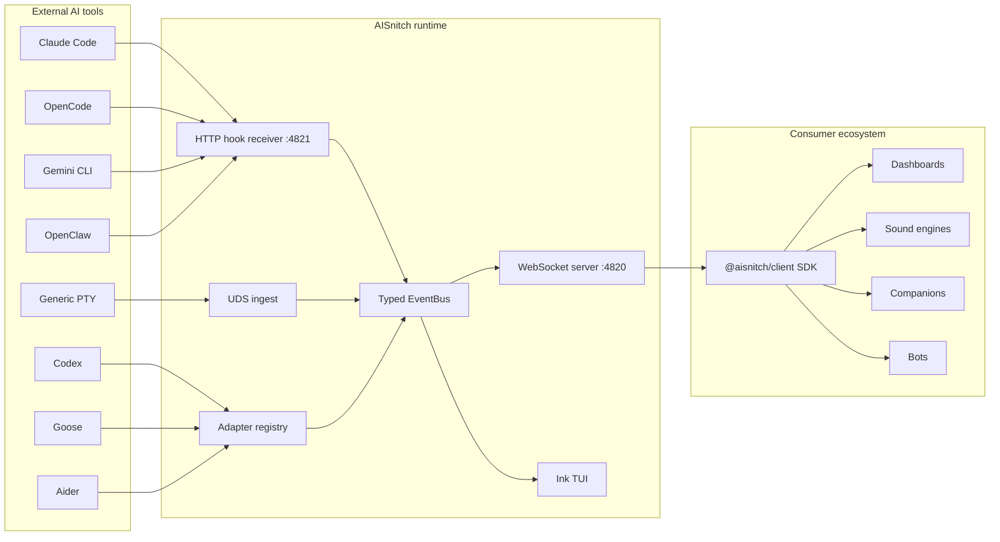

# AISnitch

**See what your AI agents are doing. All of them. In real time.**

[](https://github.com/vava-nessa/AISnitch/actions/workflows/ci.yml)
[](https://www.npmjs.com/package/aisnitch)
[](https://www.npmjs.com/package/@aisnitch/client)
[](https://nodejs.org/)
[](./LICENSE)

AISnitch is a local daemon that captures activity from **every AI coding tool** running on your machine — Claude Code, OpenCode, Gemini CLI, Codex, Goose, Aider, Copilot CLI, OpenClaw, and any CLI via PTY fallback — normalizes everything into a single event stream, and broadcasts it over WebSocket.

- **One stream, all tools** — no more switching between terminals to see what each agent is doing
- **Zero storage** — pure memory transit, nothing persists to disk, ever
- **Build anything on top** — dashboards, sound engines, animated companions, Slack bots, menu bar widgets

<!-- TODO: Add TUI demo GIF here -->

---

## Table of Contents

- [Why AISnitch?](#why-aisnitch)
- [Quick Start](#quick-start)
- [Install](#install)
- [Ecosystem](#ecosystem)
- [How It Works](#how-it-works)
- [Architecture](#architecture)
- [Supported Tools](#supported-tools)
- [Event Model](#event-model)
- [Build on Top of AISnitch](#build-on-top-of-aisnitch)
- [CLI Reference](#cli-reference)
- [TUI Keybinds](#tui-keybinds)
- [Config Reference](#config-reference)
- [Development](#development)
- [License](#license)

---

## Why AISnitch?

You run Claude Code on your main project, Codex on the API, Aider reviewing a legacy repo. Three agents, three terminals, no shared visibility. You tab-switch constantly. You miss a permission prompt. You don't know which one is idle and which one is burning tokens.

**AISnitch solves this in one line:**

```bash
aisnitch start
```

Now every tool's activity flows into one dashboard. You see who's thinking, who's coding, who needs input, and who's hit a rate limit — all at once, in real time.

Want to build your own UI instead? The entire stream is available on `ws://127.0.0.1:4820` — connect with the [Client SDK](#ecosystem) and build dashboards, sound engines, animated companions, or anything else.

---

## Quick Start

```bash
# Install and run
npm i -g aisnitch
aisnitch start

# Try it without any AI tool — simulated events
aisnitch start --mock all
```

That's it. The TUI dashboard opens, and you see live activity from every configured AI tool.

To set up tools:

```bash
aisnitch setup claude-code    # hooks into Claude Code
aisnitch setup opencode       # hooks into OpenCode
aisnitch adapters             # check what's enabled
```

---

## Install

**npm (recommended):**

```bash
npm i -g aisnitch
```

**Homebrew:**

```bash
brew install aisnitch
```

**From source:**

```bash
git clone https://github.com/vava-nessa/AISnitch.git
cd AISnitch
pnpm install && pnpm build
node dist/cli/index.js start
```

---

## Ecosystem

AISnitch ships as two packages with distinct audiences:

| Package | For | Install |
|---|---|---|
| [`aisnitch`](https://www.npmjs.com/package/aisnitch) | **Users** — the daemon, CLI, TUI dashboard, adapters | `npm i -g aisnitch` |
| [`@aisnitch/client`](https://www.npmjs.com/package/@aisnitch/client) | **Developers** — TypeScript SDK to consume the event stream | `pnpm add @aisnitch/client zod` |

**You're a user?** Install `aisnitch`, run `aisnitch start`, you're done.

**You're building something on top?** Install `@aisnitch/client` and connect in 3 lines:

```typescript
import { createAISnitchClient, describeEvent } from '@aisnitch/client';
import WebSocket from 'ws';

const client = createAISnitchClient({ WebSocketClass: WebSocket as any });
client.on('event', (e) => console.log(describeEvent(e)));
// → "claude-code is editing code → src/index.ts [myproject]"
```

Auto-reconnect, Zod-validated parsing, session tracking, filters, mascot state mapping — all included. See the full **[Client SDK documentation](./packages/client/README.md)**.

---

## How It Works

```
   Claude Code ──┐
   OpenCode ─────┤
   Gemini CLI ───┤── hooks / file watchers / process detection
   Codex ────────┤
   Goose ────────┤
   Aider ────────┤
   Copilot CLI ──┤
   OpenClaw ─────┘
                 │
                 ▼
        ┌─────────────────┐
        │  AISnitch Core   │
        │                  │
        │  Validate (Zod)  │
        │  Normalize       │
        │  Enrich context  │
        │  (terminal, cwd, │
        │   pid, session)  │
        └────────┬─────────┘
                 │
        ┌────────┴─────────┐
        ▼                  ▼
   ws://127.0.0.1:4820    TUI
   (your consumers)    (built-in)
```

Each adapter captures tool activity using the best available strategy — hooks for tools that support them (Claude Code, OpenCode, Gemini CLI), file watching for log-based tools (Codex, Aider), process detection as universal fallback. Events are validated against Zod schemas, normalized into CloudEvents, enriched with context (terminal, working directory, PID, multi-instance tracking), then pushed through an in-memory EventBus. The WebSocket server broadcasts to all connected clients with per-client ring buffers (1,000 events, oldest-first drop).

**Nothing is stored on disk.** Events exist in memory during transit, then they're gone. Privacy-first by design.

---

## Architecture



---

## Supported Tools

| Tool | Strategy | Setup |
|---|---|---|
| **Claude Code** | Command hooks + JSONL transcript watching + process detection | `aisnitch setup claude-code` |
| **OpenCode** | Local plugin + process detection | `aisnitch setup opencode` |
| **Gemini CLI** | Command hooks + `logs.json` watching + process detection | `aisnitch setup gemini-cli` |
| **Codex** | `codex-tui.log` parsing + process detection | `aisnitch setup codex` |
| **Goose** | `goosed` API polling + SSE streams + SQLite fallback | `aisnitch setup goose` |
| **Copilot CLI** | Repo hooks + session-state JSONL watching | `aisnitch setup copilot-cli` |
| **Aider** | `.aider.chat.history.md` watching + notifications command | `aisnitch setup aider` |
| **OpenClaw** | Managed hooks + command/memory/session watchers | `aisnitch setup openclaw` |
| **Any other CLI** | PTY wrapper with output heuristics | `aisnitch wrap <command>` |

Run `aisnitch setup <tool>` to configure each tool, then `aisnitch adapters` to verify what's active.

---

## Event Model

Every event is a [CloudEvents v1.0](https://cloudevents.io/) envelope with AISnitch extensions:

```jsonc
{
  "specversion": "1.0",
  "id": "019713a4-beef-7000-8000-deadbeef0042",  // UUIDv7
  "source": "aisnitch://claude-code/myproject",
  "type": "agent.coding",                          // one of 12 types below
  "time": "2026-03-28T14:30:00.000Z",

  "aisnitch.tool": "claude-code",
  "aisnitch.sessionid": "claude-code:myproject:p12345",
  "aisnitch.seqnum": 42,

  "data": {
    "state": "agent.coding",
    "project": "myproject",
    "projectPath": "/home/user/myproject",
    "activeFile": "src/index.ts",
    "toolName": "Edit",
    "toolInput": { "filePath": "src/index.ts" },
    "model": "claude-sonnet-4-5-20250514",
    "tokensUsed": 1500,
    "terminal": "iTerm2",
    "cwd": "/home/user/myproject",
    "pid": 12345,
    "instanceIndex": 1,
    "instanceTotal": 3,
    "errorMessage": "Rate limit exceeded",       // only on agent.error
    "errorType": "rate_limit",                    // only on agent.error
    "raw": { /* original adapter payload */ }
  }
}
```

### The 12 Event Types

| Type | What it means |
|---|---|
| `session.start` | A tool session began |
| `session.end` | Session closed |
| `task.start` | User submitted a prompt |
| `task.complete` | Task finished |
| `agent.thinking` | Model is reasoning |
| `agent.streaming` | Model is generating output |
| `agent.coding` | Model is editing files |
| `agent.tool_call` | Model is using a tool (Bash, Grep, etc.) |
| `agent.asking_user` | Waiting for human input |
| `agent.idle` | No activity (120s timeout, configurable) |
| `agent.error` | Something went wrong (rate limit, API error, tool failure) |
| `agent.compact` | Context compaction / memory cleanup |

---

## Build on Top of AISnitch

The whole point of AISnitch is to be a platform. Here are 5 things you can build with the [`@aisnitch/client`](./packages/client/README.md) SDK:

### Live Dashboard

```typescript
import { createAISnitchClient, describeEvent } from '@aisnitch/client';
import WebSocket from 'ws';

const client = createAISnitchClient({ WebSocketClass: WebSocket as any });

client.on('connected', (w) => {
  console.log(`Connected to AISnitch v${w.version}`);
  console.log(`Active tools: ${w.activeTools.join(', ')}`);
});

client.on('event', (e) => {
  const line = describeEvent(e);
  console.log(`[${e['aisnitch.tool']}] ${line}`);
});

// Track all active sessions
setInterval(() => {
  const sessions = client.sessions?.getAll() ?? [];
  console.log(`\n--- ${sessions.length} active session(s) ---`);
  for (const s of sessions) {
    console.log(`  ${s.tool} → ${s.lastActivity} (${s.eventCount} events)`);
  }
}, 5000);
```

### Sound Notifications (PeonPing-style)

```typescript
import { createAISnitchClient, filters } from '@aisnitch/client';

const client = createAISnitchClient({ WebSocketClass: WebSocket as any });

const SOUNDS: Record<string, string> = {
  'session.start':     'boot.mp3',
  'task.complete':     'success.mp3',
  'agent.asking_user': 'alert.mp3',
  'agent.error':       'error.mp3',
  'agent.coding':      'keyboard.mp3',
};

client.on('event', (e) => {
  const sound = SOUNDS[e.type];
  if (sound) playSound(`./sounds/${sound}`);
});
```

### Animated Mascot / Companion

```typescript
import { createAISnitchClient, eventToMascotState } from '@aisnitch/client';

const client = createAISnitchClient();

client.on('event', (e) => {
  const state = eventToMascotState(e);
  // state.mood    → 'thinking' | 'working' | 'celebrating' | 'panicking' | ...
  // state.animation → 'ponder' | 'type' | 'dance' | 'shake' | ...
  // state.color   → '#a855f7' (hex)
  // state.label   → 'Thinking...'
  // state.detail  → 'src/index.ts' (optional)
  updateMySprite(state);
});
```

### Slack / Discord Bot

```typescript
import { createAISnitchClient, filters, formatStatusLine } from '@aisnitch/client';
import WebSocket from 'ws';

const client = createAISnitchClient({ WebSocketClass: WebSocket as any });

// Only notify on events that need attention
client.on('event', (e) => {
  if (filters.needsAttention(e)) {
    postToSlack(`⚠️ ${formatStatusLine(e)}`);
  }

  if (e.type === 'task.complete') {
    postToSlack(`✅ ${formatStatusLine(e)}`);
  }
});
```

### Menu Bar Widget (Electron / Tauri)

```typescript
import { createAISnitchClient, formatStatusLine } from '@aisnitch/client';

const client = createAISnitchClient();
let sessionCounter = 0;
const sessionMap = new Map<string, number>();

client.on('event', (e) => {
  if (!sessionMap.has(e['aisnitch.sessionid'])) {
    sessionMap.set(e['aisnitch.sessionid'], ++sessionCounter);
  }
  const num = sessionMap.get(e['aisnitch.sessionid'])!;

  // Update your menu bar / tray icon
  tray.setTitle(formatStatusLine(e, num));
  tray.setToolTip(`${client.sessions?.count ?? 0} active sessions`);
});
```

For complete API docs, React/Vue hooks, filters, TypeScript integration, and more examples, see the **[Client SDK README](./packages/client/README.md)**.

<details>
<summary>Raw WebSocket (without SDK)</summary>

If you don't want the SDK, you can connect directly:

```bash
# One-liner to see raw events
node -e "
  const WebSocket = require('ws');
  const ws = new WebSocket('ws://127.0.0.1:4820');
  ws.on('message', m => {
    const e = JSON.parse(m.toString());
    if (e.type !== 'welcome') console.log(e.type, e['aisnitch.tool'], e.data?.project);
  });
"
```

The first message is always a `welcome` payload with version, active tools, and uptime. Every subsequent message is a CloudEvents event as described above.

</details>

### Health Check

```bash
curl http://127.0.0.1:4821/health
```

```json
{
  "status": "ok",
  "uptime": 3600,
  "consumers": 2,
  "events": 1542,
  "droppedEvents": 0
}
```

---

## CLI Reference

```bash
# Dashboard mode (always opens the TUI)
aisnitch start
aisnitch start --tool claude-code      # pre-filter by tool
aisnitch start --type agent.coding     # pre-filter by event type
aisnitch start --view full-data        # expanded JSON inspector

# Background daemon
aisnitch start --daemon
aisnitch status                        # check if daemon is running
aisnitch attach                        # open TUI attached to running daemon
aisnitch stop                          # kill daemon

# Raw event logger (no TUI, full payload)
aisnitch logger

# Tool setup (run once per tool)
aisnitch setup claude-code
aisnitch setup opencode
aisnitch setup gemini-cli
aisnitch setup codex
aisnitch setup goose
aisnitch setup copilot-cli
aisnitch setup aider
aisnitch setup openclaw
aisnitch setup claude-code --revert    # undo setup

# Check enabled adapters
aisnitch adapters

# Demo mode (simulated events)
aisnitch mock claude-code --speed 2 --duration 20
aisnitch start --mock all

# PTY wrapper (any unsupported CLI)
aisnitch wrap aider --model sonnet
aisnitch wrap goose session
```

---

## TUI Keybinds

| Key | Action |
|---|---|
| `q` / `Ctrl+C` | Quit |
| `d` | Start / stop the daemon |
| `r` | Refresh daemon status |
| `v` | Toggle full-data JSON inspector |
| `f` | Tool filter picker |
| `t` | Event type filter picker |
| `/` | Free-text search |
| `Esc` | Clear all filters |
| `Space` | Freeze / resume live tailing |
| `c` | Clear event buffer |
| `?` | Help overlay |
| `Tab` | Switch panel focus |
| `↑↓` / `jk` | Navigate rows |
| `[` `]` | Page inspector up / down |

---

## Config Reference

AISnitch state lives under `~/.aisnitch/` (override with `AISNITCH_HOME`).

| Path | Purpose |
|---|---|
| `config.json` | User configuration |
| `aisnitch.pid` | Daemon PID file |
| `daemon-state.json` | Daemon connection info |
| `daemon.log` | Daemon output log (5 MB max) |
| `aisnitch.sock` | Unix domain socket (IPC) |

| Port | Purpose |
|---|---|
| `4820` | WebSocket stream (consumers connect here) |
| `4821` | HTTP hook receiver + `/health` endpoint |

---

## Development

```bash
pnpm install
pnpm build              # ESM + CJS + .d.ts (main + client SDK)
pnpm lint               # ESLint
pnpm typecheck          # tsc --noEmit
pnpm test               # Vitest (156 tests)
pnpm test:coverage
pnpm test:e2e           # requires opencode installed

# Client SDK only
pnpm --filter @aisnitch/client build
pnpm --filter @aisnitch/client test   # 48 tests
```

Project structure:

```
aisnitch/                  # main package — daemon, CLI, TUI, adapters
├── src/
│   ├── adapters/          # 13 adapter implementations
│   ├── cli/               # commander commands
│   ├── core/              # events, pipeline, config
│   └── tui/               # Ink dashboard
├── packages/
│   └── client/            # @aisnitch/client SDK
│       └── src/           # types, client, sessions, filters, helpers
├── docs/                  # technical documentation
└── tasks/                 # kanban task board
```

Docs: [`docs/index.md`](./docs/index.md) | Tasks: [`tasks/tasks.md`](./tasks/tasks.md)

Contributing: [`CONTRIBUTING.md`](./CONTRIBUTING.md) | [`CODE_OF_CONDUCT.md`](./CODE_OF_CONDUCT.md)

---

## License

Apache-2.0, © [Vanessa Depraute / vava-nessa](https://github.com/vava-nessa).
